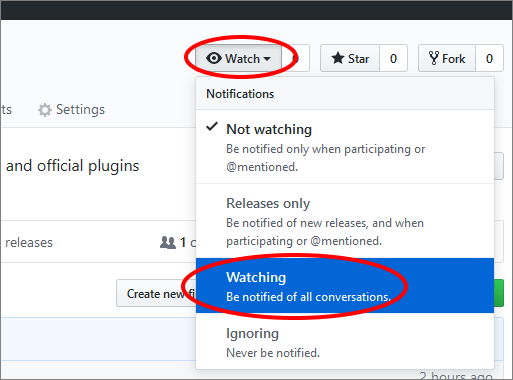

# Announcements

This repo is for team **announcements** only. To file a **bug**, ask a **question** or start a **discussion**,
please go to <https://github.com/Rhetos/Rhetos/issues> and create a new issue.

Subscribe to this repo to be notified about major changes in Rhetos framework and official plugins:

All items posted to this repo are locked, but should all have links to separate discussion threads in the affected repo.
Please use those discussion threads for questions and comments about a particular announcement.
If you're not sure where to post a question, please log an issue in the [Home repo](https://github.com/Rhetos/Rhetos/issues).

---

A complete list of **breaking changes** and **new feature** for each release
is available at [ChangeLog](https://github.com/Rhetos/Rhetos/blob/master/ChangeLog.md).

Check out plans for future releases
at [Milestones](https://github.com/Rhetos/Rhetos/milestones?direction=asc&sort=title&state=open)
and [Roadmap](https://github.com/Rhetos/Rhetos/wiki/Rhetos-platform-roadmap).
